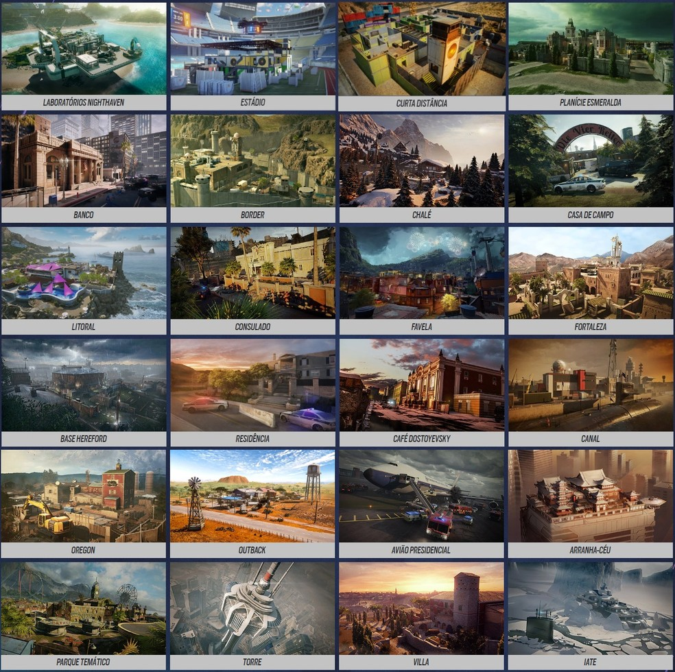

# Consejos para jugar

 - Hay diferentes mapas en el juego donde depende del mapa en el que estes jugando hay que elegir a un personaje o otro.
   
 - Para aprender a juagar se recomienda ver a gente que lo juega bien y analizar su jugada. [**Caramelo**](https://www.youtube.com/@CarameloYT)
 - Como en todos los juegos depende de donde jueges pero si juegas en ordenador un gran consejo es optimizar lo mejor posible los graficos. Este video es lo utlimo en configuracion de *R6*
   [**Config 24/25**](https://www.youtube.com/watch?v=27W2Sr1O3g0)
 - 
