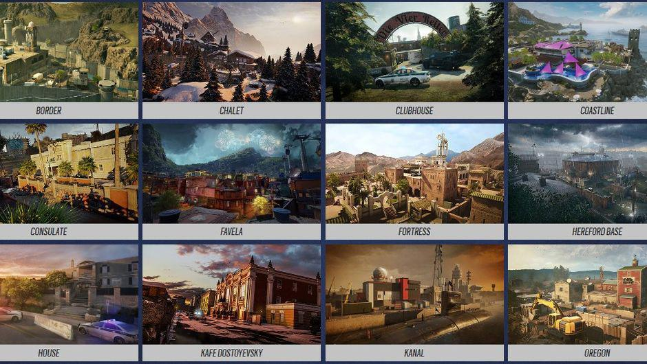

# Consejos para jugar

 - Hay diferentes mapas en el juego donde depende del mapa en el que estés jugando hay que elegir a un personaje u otro.
   
    - Estos son los mapas más jugados.
   
   
   =========================
 - Para aprender a jugar se recomienda ver a gente que lo juega bien y analizar su jugada. [**Caramelo**](https://www.youtube.com/@CarameloYT)
 - Como en todos los juegos depende de donde juegues, pero si juegas en ordenador un gran consejo es optimizar lo mejor posible los gráficos. Este video es lo último en configuración de *R6*
   [**Config 24/25**](https://www.youtube.com/watch?v=27W2Sr1O3g0)
 - Tener paciencia si te eliminan. Y ayudar a tus compañeros a eliminar al equipo enemigo dando información.
 - Escuchar a la otra gente que te está hablando para poder saber donde están los enemigos.
 - Ayudar a tus compañeros a reforzar el sitio donde están las bombas (*site*) para hacer más difícil que los atacantes entren.
