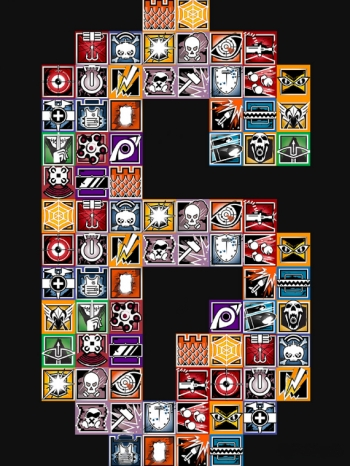

# Rainbow Six Siege

Rainbow Six Siege (*R6*) és un juego donde hay **dos** bandos uno atacante que lo que intenta es conseguir desmontar una bomba gracias a una herramienta llamada ***defuser*** se peude ganar de dos formas desmontando las bombas o eliminando a todo el equipo contrario, y el lado defensor lo tiene que evitar lo puede conseguir de dos formas una de ellas es eliminar a todo el equipo contrario o consiguiendo que se acabe el tiempo de la ronda.

En cada partida y en cada bando son grupos de **5** asi que es recomendable jugar con 4 amigos mas para poder disfrutar al maximo del juego.

En cada bando hay diferentes personajes que puedes escoger.

Estos son todos los personajes.

Los creadores de este juego *R6* es una empresa famosa llamada [**Ubisoft**](https://www.ubisoft.com/es-es/game/rainbow-six/siege) el juego se tiene que comprar cuesta 20,00€

Al igual que en todos los juegos hay un apartado de Esports competitivo en el que hay un **mundial** para llegar a ser el mejor club.

El *ranking* de los mejores clubes són: 

- G2 Esports
- Team Liquid
- Ninjas in Pyjamas
- Wolves Esports

## Consejos para jugar

Hay diferentes mapas en el juego donde depende del mapa en el que estes jugando hay que elegir a un personaje o otro.
Para aprender a juagar se recomienda ver a gente que lo juega bien y analizar su jugada. [**Caramelo**](https://www.youtube.com/@CarameloYT)
